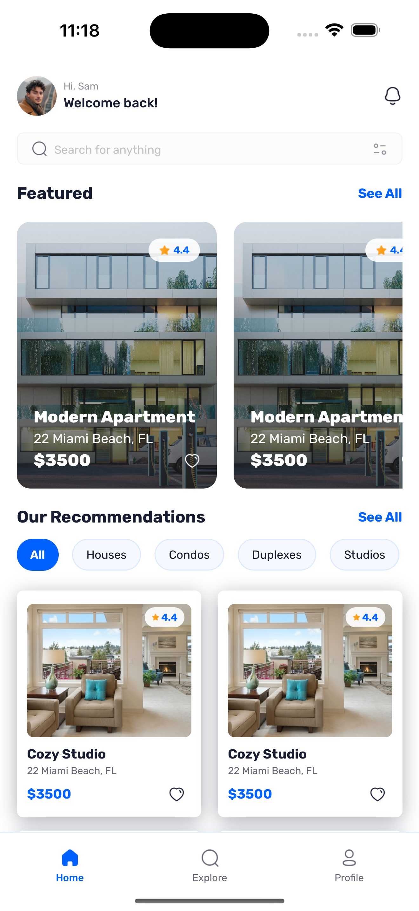
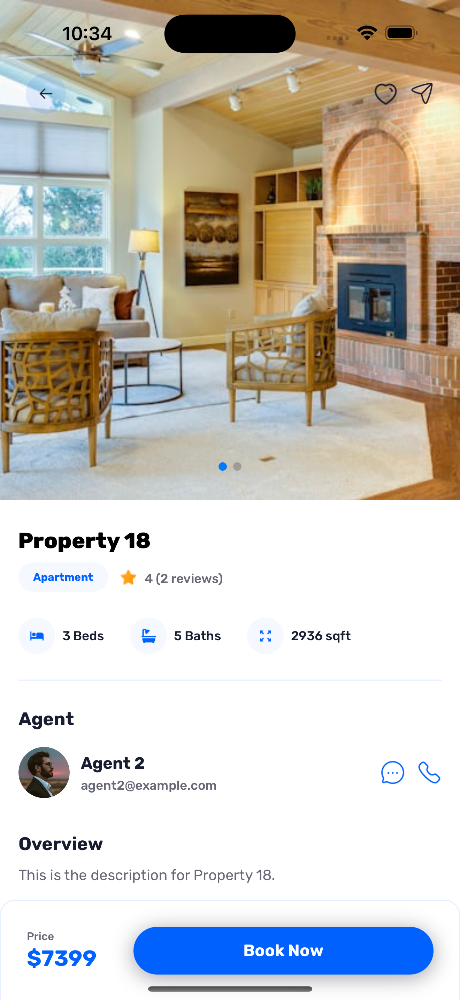
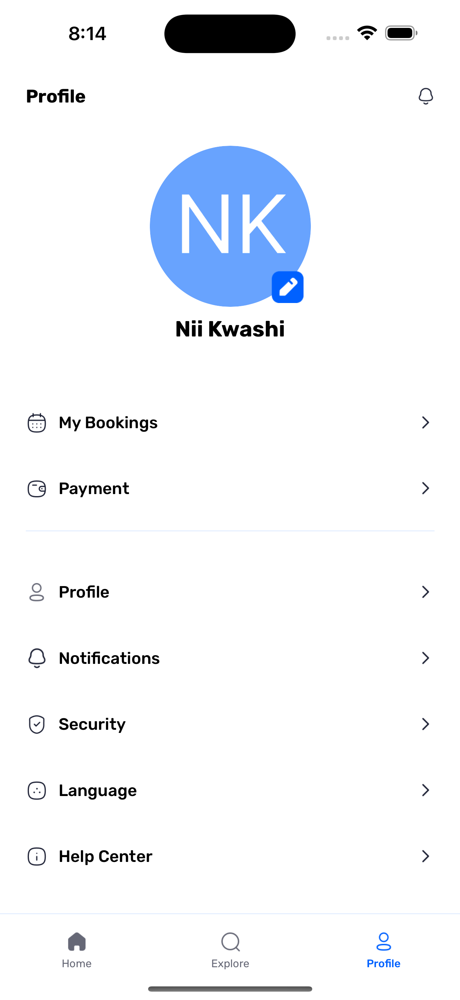
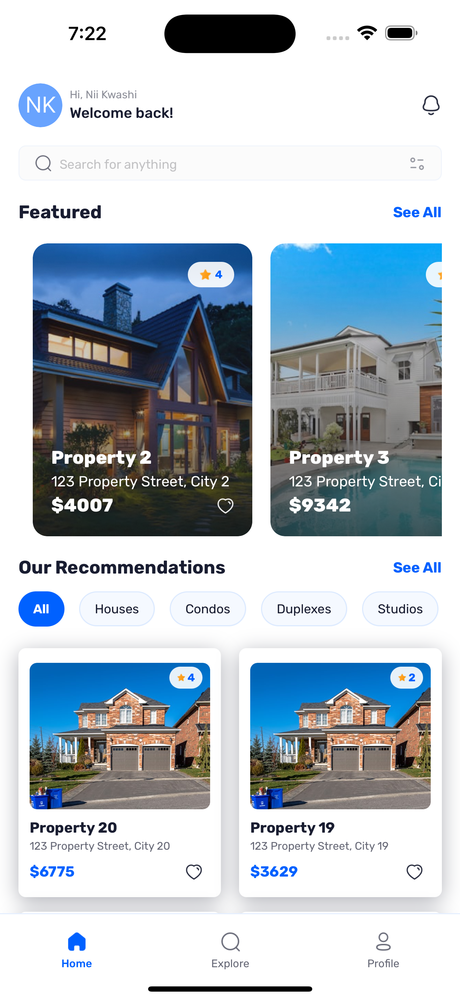
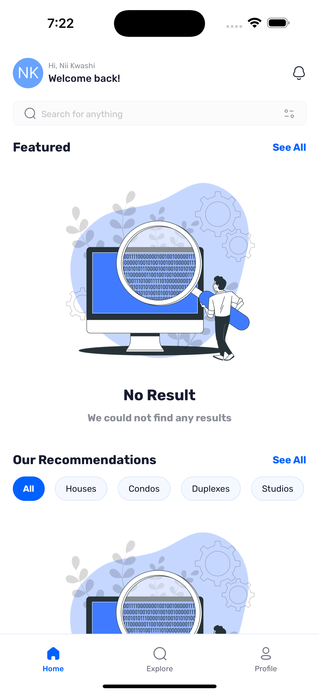

# Restate - Modern Property Marketplace App

<p align="center">
  
</p>

A modern, feature-rich mobile application for property search and management, built with React Native, Expo, and Appwrite.

## 🌟 Features

- **Google Authentication**: Secure user authentication using Google OAuth
- **Property Search**: Advanced search functionality with filters
- **Real-time Updates**: Live property listings and updates
- **Interactive UI**: Modern and responsive design with smooth animations
- **Property Details**: Comprehensive property information including:
  - Image galleries
  - Property specifications
  - Agent information
  - Location details
  - Facilities overview
- **Favorites System**: Save and manage favorite properties
- **User Profiles**: Personalized user experience

## 🛠️ Technology Stack

- **Frontend Framework**: React Native with Expo
- **Styling**: TailwindCSS (NativeWind)
- **Backend & Authentication**: Appwrite
- **Navigation**: Expo Router
- **State Management**: React Context API
- **Type Safety**: TypeScript

## 📱 Screenshots

[You can add screenshots of your app here]

## 🚀 Getting Started

1. Clone the repository

```bash
git clone https://github.com/yourusername/restate.git
```

2. Install dependencies

```bash
cd restate
npm install
```

3. Set up environment variables

```bash
# Create a .env file and add your Appwrite credentials
EXPO_PUBLIC_APPWRITE_ENDPOINT=your_endpoint
EXPO_PUBLIC_APPWRITE_PROJECT_ID=your_project_id
EXPO_PUBLIC_APPWRITE_DATABASE_ID=your_database_id
```

4. Start the development server

```bash
npm start
```

## 🏗️ Project Structure

```plaintext
restate/
├── app/                   # Application screens
├── assets/               # Static assets
├── components/           # Reusable components
├── constants/            # App constants
└── lib/                  # Utility functions
```

## 🎯 Key Features Implementation

### Authentication Flow

- Secure OAuth2 implementation with Google
- Persistent session management
- Protected routes

### Property Management

- Real-time property data fetching
- Advanced filtering system
- Image gallery management
- Detailed property information display

### User Experience

- Smooth animations
- Responsive design
- Cross-platform compatibility
- Error handling
- Loading states

## 📱 Screenshots

<div style="display: flex; flex-wrap: wrap; gap: 10px; justify-content: center; flex-direction: row">







</div>

## 🤝 Contributing

Contributions are welcome! Please feel free to submit a Pull Request.

## 📄 License

This project is licensed under the MIT License - see the LICENSE file for details.

## 👨‍💻 Author

Your Name

- GitHub: @simiel
- LinkedIn: https://www.linkedin.com/in/samensah/

## 🙏 Acknowledgments

- Expo for the amazing development platform
- Appwrite for the backend services
- NativeWind for the styling solution
- JavaScript Mastery Channel @youtube
